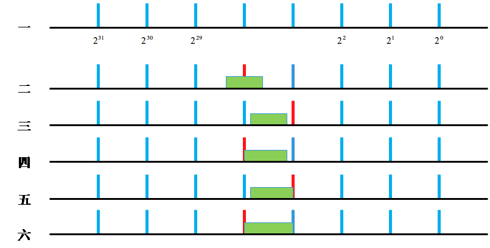

#### 题目

输入一个范围[m, n]，满足， 0 <= m <= n <= 2147483647，将该范围内的所有数按位进行与操作，输出该结果。

#### 示例

输入：[5, 7]

101 & 110 & 111 = 100 = 4

输出：4

#### 分析

方案1：

从 m - n，依次进行与操作，时间复杂度为 O(n-m)

方案2:

考虑到上述算法的复杂度不够理想，对其进行改进。首先看如下性质：

> 因为 2^i & (2^i - 1) = 0，所以，如果 m < 2^i <= n，则输出结果必定为0。

如下图所示：

1. 还有一种特殊情况，m = n 此时结果为 m 或 n；
2. 在二、四、六的情况中，都包含一个 2^i 和 (2^i - 1)，其输出结果必定为0；
3. 在三、五情况下：假设 m >= 2^i，n < 2^(i+1)，令 a = m - 2^i, b = n - 2^i，满足 a < b。则输出结果为：2^i + [a, b]

#### 流程

1. 如果 m=n，则返回 m
2. 找到图中的红线。即，从 iBit = 2^31 开始，如果 iBit > n，则 iBit 右移一位。
3. 如果 iBit > m，则返回0，否则返回 iBit + [m & (iBit-1), n & (iBit-1)]

其中：m & (iBit-1) = m - iBit，n & (iBit-1) = n - iBit。[a, b]表示范围为[a, b]时候的输出，也就是递归调用。
