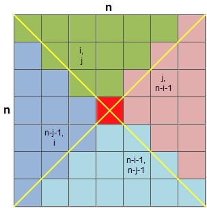

#### 题目

给定一个 n x n 的二维矩阵，该矩阵表示一幅图像。将该图像顺时针旋转90度。

> 在原图像中旋转，不额外开辟图像空间。

#### 示例

输入：

    4 12 20 28
    3 11 19 27
    2 10 18 26
    1 9 17 25

输出：

    1 2 3 4
    9 10 11 12
    17 18 19 20
    25 26 27 28

#### 分析

如下图所示：

方阵可以等分成四个区域，上、下、左、右，用不同颜色标识，每个区域旋转90度之后将于其他区域完全重合。所以，顺时针旋转90度可以看作：上到右，右到下，下到左，左到上的变化。

由于此时n为奇数，所以会有个共同的红色区域，旋转之后依旧是本身。如果n为偶数，则正好可以分为四个区域。

#### 流程

1. 遍历上部分所有元素
2. 旋转
    1. 保存上部份元素
    2. 左到上
    3. 下到左
    4. 右到下
    5. 上到右

