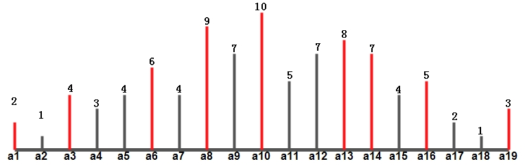
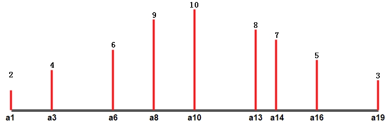

#### 题目

给定一个正数数组，数组中的第i个元素ai表示一个点坐标(i, ai)，每个点对应一条直线(i, 0)。找出两条直线，使它们与x轴构成一个容器。找到一个容器，是该容器中能装的水比其他容器都多。

> 大概意思就是垂直与x轴的两条线段与x轴构成的容器能容纳最多的水。而容器容纳的水量由最短线段决定（木桶原理）

#### 示例

输入：'[1, 2, 3, 4, 5, 6, 7, 8, 9, 10]'
输出：`25`

输入：`[5, 2, 12, 1, 5, 3, 4, 11, 9, 4]`
输出：`55`

#### 分析

给出下列定理：

假设m 和 n (m < n)构成了满足要求的容器，也就是说面积 (n - m) * min(am, an) 最大。

+ 定理一：n 之后元素aj都比an小

证明：假设aj > an，则由于(j - m) > (n - m)，并且min(am, aj) >= min(am, an)，所以 (n - m) * min(am, an) 必定小于  (j - m) * min(am, aj)，与题设矛盾，结论得证。

+ 定理二：m 之前元素ai都比am小

同理可证。

因此：可以从两头向中间靠拢，同时更新候选值；在收缩区间的时候优先从i, j中较小的边开始收缩。

#### 方法1

从较小边开始收缩，一次收缩多个元素（找到下一个比当前元素大的元素）。

证明：

如下图所示：

1. 假设[a1, a19]构成一个初始最优解。那么，根据定理一和定理二，[a2, a19]，[a1, a18]，[a1, a17]，[a2, a18]，[a2, a17]必定不是最优解。所以这几组容器的面积不用计算，可以直接跳过。

2. 在[a1, a19]中从a1开始查找，直到A[iLeftNew] > A[a1]，也就是a3；在[a1, a19]中从a19开始查找，直到A[iRightNew] > A[a19]，也就是a16。

3. 计算的是[a1, a16]，[a3, a19]。然后以[a3, a16]为区间，跳转到1。

实际上，上述过程遍历的值就是从左侧递增的值和从右侧递增的值。如下图所示：

> 另外，在步骤3中，因为A[a1] < A[a19]，所以[a1, a16] 必定是小于[a1, a19]的。而[a3, a19]就不一定小于[a1, a19]。所以，步骤三种可以进一步优化：找到较小的边，从较小的开始收缩。

#### 方法1

从较小边开始收缩，一次收缩一个元素。

如下图所示：

1. 假设[a1, a19]构成一个初始最优解。
2. 计算[a1, a19]
3. 由于A[a1] < A[a19]，所以从a1处开始收缩，下一个区间为[a2, a19]，跳转到2

> 事实上这种收缩方式包含很多无效区间，但是包含了方法1中的所有有效区间。例如：更新区间依次为：`[a1, a19]`、[a2, a19]、`[a3, a19]`、[a3, a18]、[a3, a17]、`[a3, a16]`...。因此，方法1必定更高效。

#### 流程

1. 初始化，iLeft 最左，iRight 最右，面积 iMaxArea = 0
2. 如果当前面积大于 iMaxArea，则赋给 iMaxArea
3. 如果A[iLeft] < A[iRight]
    在[iLeft, iRight]中从iLeft开始查找，直到A[iLeftNew] > A[iLeft]，iLeft = iLeftNew
4. 如果A[iLeft] >= A[iRight]
    在[iLeft, iRight]中从iRight开始查找，直到A[iRightNew] > A[iRight]，iRight = iRightNew
5. 如果iLeft < iRight，继续2，否则结束
