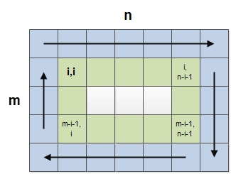

#### 题目

给定一个正整数n，产生一个元素为1-n^2的螺旋矩阵。

#### 示例

输入：3

输出：

    [
     [ 1, 2, 3 ],
     [ 4, 5, 6 ],
     [ 7, 8, 9 ]
    ]

#### 分析

> 此题与《Spiral Matrix》完全类似

如上图所示：产生螺旋矩阵可以进行细分，每次遍历当前矩阵的外边缘。即第一次遍历蓝色的边缘，第二次遍历绿色的边缘，第三次遍历中间的白色。

遍历矩阵边缘依然可以细分：
1. 遍历上边缘
2. 遍历右边缘
3. 遍历下边缘
4. 遍历左边缘

而遍历矩阵边缘需要确定几个参数，也就是界定矩阵边缘大小的参数：
1. 矩阵边缘起始坐标（其实就是(i,i)，而i的最大值就是m和n中较小值的一般，向上取整）
2. 矩阵边缘的行数：n-i
3. 矩阵边缘的列数：m-i

> 但是有个地方需要注意：最后一个矩阵边缘有可能只有一行或者一列，如图中的白色部份所示，所以要有额外的判断，不能重复遍历。

#### 流程

1. 初始(i, i)为(0, 0)
2. 判断(i, i)是否(min(m, n) + 1)/2，是则继续3，否则结束
3. 遍历上边缘 ((i,i) 到 (i, n-i-1))
4. 遍历右边缘 ((i+1,n-i-1) 到 (m-i-1, n-i-1))
5. 遍历下边缘 ((m-i-1,n-i-2) 到 (m-i-1, i))
6. 遍历左边缘 ((m-i-2,i) 到 (i+1,i))
7. i++，跳转到2

> PS：下边界是要判断是否就是上边界，左边界时要判断是否就是右边界。
